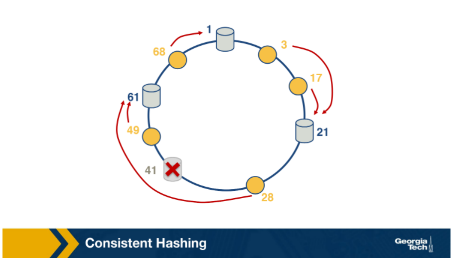

In this article we will post questions and answers to understand the concept of CDNs and overlay networks

### What is the drawback to using traditional approach of having a single, publicly accessible server?

1. Geographic distance: Users are located all over the globe, there is potentially vast geographic distance between the users and the data center. When packets traverse lots of links it is possible that a link has a lower throughput resulting in increased time to travel.
2. Demand spikes: Popular resources such as a video can be requested many times, having a single server to repeatedly be sending the exact same data over the same communication link over and over again wastes bandwidth and it is financially costly to the content provider.
3. Single point of failure: In case of accidents, such as natural disaster or a massive power outage the entire data center can be taken offline.

### What is a CDN?

CDNs stands for **Content Distribution Networks**. CDNs are networks of multiple, geographically distributed servers and/or data centers holding copies of content and serve users from a server or a server cluster that matches best to the user request. CDNs address the issues discussed above.

### What are the six major challenges that internet applications face?

- Peering point congestion: There is motivation to upgrade the "first mile"(e.g. web hosts) and the "last mile"(e.g. end users) but not for the "middle-mile", which ends up being a bottleneck causes an increase of packet loss and latency.
- Inefficient routing protocols: BGP protocol does not take into account factors such as **congestion** and **latencies**, it is only concerned with AS(Autonomous System) hop count, this combined with BGP's well-documented vulnerabilities to malicious actions makes an inefficient inter-domain routing protocol for **modern internet**.
- Unreliable networks: Combination of natural and malicious incidents can cause outages
- Inefficient communication protocols: Like BGP, TCP was not designed for the demands of the modern internet. TCP requires as "Ack" for each data packets sent and this could become a bottleneck. Despite all research into ways to improve TCP, enhancements are slow to actually get implemented.
- Scalability: Scaling up infrastructure is expensive and takes time and it is hard to forecast what capacity needs will be.
- Application limitations and slow rate of change adoption: Some users are still using outdated applications such as Internet Explorer 6 which does not implement newer protocols. Adoption of better protocols on the server and client side are both slow.

### What are the major shifts that have impacted the evolution of the internet ecosystem?

1. There is an increased demand for online content, especially videos. This demand has spiked the development and growth of CDNs, in place of traditional single, massive data center.
2. The second shift is a "topological flattening" meaning the hierarchical topology has transitioned to more flat. IXPs have increased in popularity due to:
    1. Services offered
    2. Lower network operation costs for the ISPs and interconnection costs

These shifts mean more traffic is generated and exchanged locally, instead of traversing the complete hierarchy.

### Compare the "enter deep" and "bring home" approach of CDN server placement.

When placing CDNs there are two approaches, deploying lots of small clusters to get as close as possible to the users, or deploying fewer but larger clusters to critical areas.

1. Enter deep: Place many smaller server clusters "deep" into the access networks, e.g. Akamai, which have clusters in over 1700 locations. Minimizing the distance = Reducing delay and increasing bandwidth. Downside is the difficulty in maintenance and management of so many clusters.
2. Bring home: Place fewer larger server clusters at key points, typically in IXPs, "bringing the ISPs home". Downside is that the users will experience higher delay and lower throughput.

### What is the role of DNS in the way CDN operates?

With CDNs, there is an extra step where somehow the CDN will need to intercept the request in order to be able to decide which server cluster should service the request. DNS plays a major role in this step. By intercepting the requests with DNS, CDNs have the opportunity to choose where to direct users based on location, load on the servers, current traffic or other conditions.

What are the two main steps in CDN server selection?

1. Mapping the client to a cluster
2. Selecting a server from the cluster

### What is the simplest approach to select a cluster? What are the limitations of this approach?

Pick the geographically closes cluster. Limitations are:

- CDNs are interacting with the LDNS(Local Domain Name Server) of clients, so picking the geographically closest cluster is really picking the cluster closest to the LDNS and not the end user.
- Geographically closest may not be the best choice in terms of actual e2e network performance.

### What metrics could be considered when using measurements to select a cluster?

There are various e2e metrics, e.g. network layer metrics such as **delay, bandwidth** or both. Or application layer metrics, e.g. in case of video **re-buffering ratio** and **average bitrate**. Similarly, for web-browsing **page load time** can be used.

How are the metrics for cluster selection obtained?

- Active measurements: LDNS could probe multiple clusters by sending a ping request for monitoring the RTT
- Passive measurements: The name server system in the CDN could keep track of the performance metrics on the current traffic conditions. This requires a centralized controller which has a real-time view of the network conditions between all client-cluster pairs.

### Explain the distributed system that uses a 2-layered system. What are the challenges of this system?

Given the scale of today's internet having a centralized controller to monitor performance of client-cluster pairs is challenging, the proposal is to use a 2-layered system:

- A coarse-grained global layer operating at larger time scales keeping a global view of client quality measurements building a data-driven prediction model of video(content) quality.
- A fine-grained per client decision layer operating at millisecond making actual decisions based on the pre-computed global model and client state.

### What are the strategies for server selection? What are the limitations of these strategies?

- Simplest strategy could be to assign a server randomly, it is simple but not optimal. Workload for different servers are not the same, random assignment might end up selecting a highly loaded server.
- Map the requests based on the content meaning requests for the same piece of content can be mapped to the same machine, e.g. using a content-based hashing. When there is a change in the cluster environment, the hash table needs to be recomputed and this is not optimal.

### What is consistent hashing? How does it work?

Consistent hashing is an example of distributed has table and requires relatively little movement when nodes join and leave the system. The main idea is that servers and the content objects are mapped to the same ID space.

When server 41 leaves, the successor for content 28 becomes server 61.

Why would a centralized design with a single DNS server not work?

- It introduces a single point of failure
- It would be very difficult for a single server to handle all the volume of the querying traffic
- Maintenance of a huge centralized database would be a big problem, e.g. updates for every single host in the internet

### What are the main steps that a host takes to use DNS?

The client requests the IP address for a certain domain, it first contacts the root server and then the request flows down to the top level domain server and finally the authoritative server for the hostname.

What are the services offered by DNS, apart from hostname resolution?

- Mail server/Host aliasing
- Load distribution

### What is the difference between iterative and recursive DNS queries?

- In the iterative query process, the querying host is referred to a different DNS server in the chain, until it can fully resolve the request
- In the recursive query, each DNS server in the chain queries the next server and delegates the query to it.

### What is a DNS resource record?

The DNS servers store the mappings between hostnames and IP addresses as Resource Records(RRs) and they contain four fields:

- Name
- Value
- Type
- TTL

The most common types are:

- A: (domain name, IP address of the hostname)
- NS: (domain name, authoritative DNS server that can obtain IP addresses for hosts in that domain)
- CNAM: (alias hostname, canonical name)
- MX: (alias hostname of a mail server, canonical name of the mail server)