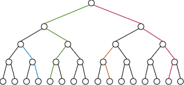

For a long time, regret was a heavy companion. Whenever I felt it looming, I'd get caught in an intense spiral of "what ifs." How could things have gone differently? How could I have avoided this outcome? My mind would race through seemingly infinite alternative scenarios, a frustrating and exhausting exercise.

Recently, though, a different way of thinking sparked – viewing regret through a computational lens. The conclusion I reached was startlingly simple: **Regret, in a computational sense, doesn't logically exist.** There are only decision points in life, and each choice sends us down a unique timeline, a distinct trajectory. This idea resonated deeply, and I wanted to explore it further, using computational and mathematical concepts to formalize it, both for myself and for others who might find this perspective helpful. Writing this post is part of that process. Encouragingly, since adopting this view, I find myself dwelling on regret far less often; it's genuinely helped me let go and refocus.

## Decisions as Branches: Introducing the Binary Tree

Let's start with a fundamental concept from computer science: the **tree**, specifically a **binary tree**. Trees are everywhere in computing, forming the backbone of countless algorithms and systems we use daily. In simple terms, a binary tree is a structure where each point (or **node**) can branch off into at most two other points. Think of it like a series of Yes/No questions.

Computer scientists often draw trees "upside down," with the starting point (**root**) at the top. This feels intuitive when thinking about data flow or, in our case, the flow of time and decisions.

How does this relate to life and regret? We can use a binary tree to model the decision moments in our lives. Imagine each node represents a moment where a choice is made. For simplicity, let's represent every choice as a binary Yes/No decision (though real life is more nuanced, this model captures the core idea). From the most trivial choices (chicken or fish for dinner?) to the most significant (take the job offer? propose marriage?), life is a constant stream of decisions.

Consciously or not, a choice is always made, launching us onto a specific path or **branch** of the tree. We travel along that branch until the next decision node, where another choice leads us down a _new_ branch. Our entire life, from a starting point (like turning 18) until the end, can be visualized as a unique path from the root of this decision tree to one of its endpoints (a **leaf** node).

## The Astonishing Scale of Possible Lives

Let's analyze the structure of this decision tree. A key property is its **height (H)**, which is the number of decision levels from the root to the furthest leaf.

Notice a pattern: each node potentially gives rise to two new nodes at the next level down. This doubling effect means the number of nodes _at_ a specific level (L) grows exponentially. We can represent this using powers of 2:

| Level | Nodes at this Level | Calculation |
| ----- | ------------------- | ----------- |
| 0     | 1                   | $2^0$       |
| 1     | 2                   | $2^1$       |
| 2     | 4                   | $2^2$       |
| 3     | 8                   | $2^3$       |
| 4     | 16                  | $2^4$       |
| 5     | 32                  | $2^5$       |
| ...   | ...                 | ...         |
| H     | $2^H$               | $2^H$       |

The total number of nodes in a _complete_ binary tree of height H (where every level is full) is $2^{H+1} - 1$. Why? Think of building the tree level by level. Level 0 has $1$ node. Level 1 adds $2$ nodes. Level 2 adds $4$ nodes, and so on, up to level H which adds $2^H$ nodes. The total is $1 + 2 + 4 + ... + 2^H$. This is a geometric series. A quick way to see the result is to imagine adding just _one more_ node at level H+1. This would conceptually complete the _next_ level, giving a total of $2^{H+1}$ leaves at that imaginary level. The total number of nodes in the tree up to level H is always one less than the number of potential nodes at level H+1. Hence, $2^{H+1} - 1$.

Now, let's consider the **paths**. A unique path represents a complete sequence of decisions from the start (root) to a final outcome (leaf).

In a binary tree of height H, the total number of unique paths from the root to a leaf node at that level is $2^H$. Why? At each level L (from 0 to H-1), every node presents a choice that splits into two branches. To reach a specific leaf at level H, you must make H distinct binary choices. Since there are 2 options for each of the H choices, the total number of distinct choice sequences (paths) is $2 \times 2 \times ... \times 2$ (H times), which is $2^H$. Each distinct path represents one possible unique life trajectory based on the sequence of decisions made.

## Putting It All Together: Why Regret is Computationally Unfeasible

Now, let's apply this to a hypothetical lifetime. Assume we start making decisions at age 18 and continue until age 68, spanning 50 years. Let's simplify further and assume a decision point occurs **every single hour**.

>[!info] How many decision points (nodes) does this create?
> Number of decision points *(H) = 50 years × 365 days/year × 24 hours/day = 438,000 hours*
> 
> With *H = 438,000* decision points, the total number of possible distinct life trajectories (paths from the root to a leaf) is $2^H = 2^{438,000}$. 
 >
 >This number is **astronomically large**, far exceeding the estimated number of atoms in the observable universe. It's a number so vast it's practically impossible to truly comprehend. $2^{438,000} \approx 10^{131,841}$ (This is 1 followed by over **131 thousand zeros**!)

This immense number is why I've chosen to let go of regret. When I look back at a past decision point and feel a sudden emotion of "what if," I remind myself of this tree. The path _not_ taken wasn't just one alternative; it was the entry point to an unimaginably vast tree of _other_ possible lives, $2^k$ potential futures stemming from that single point onwards (where k is the remaining decision points).

There's simply no way to know which of those countless trajectories would have been "better." We lack the information and the computational capacity to evaluate even a minuscule fraction of them. This unknowability, combined with our natural human tendency towards [counterfactual thinking](https://en.wikipedia.org/wiki/Counterfactual_thinking) (imagining alternatives, often unrealistically positive ones), makes regret a computationally unsound and emotionally draining exercise.

The past is just one path taken out of a near-infinite sea of possibilities. It cannot be changed, and its alternatives cannot be truly known. This perspective frees up mental and emotional energy. Instead of analyzing the unanalyzable past, I can focus entirely on the present node, the current decision point. Because, ultimately, **that's all that ever matters: what do I decide to do right now?**
