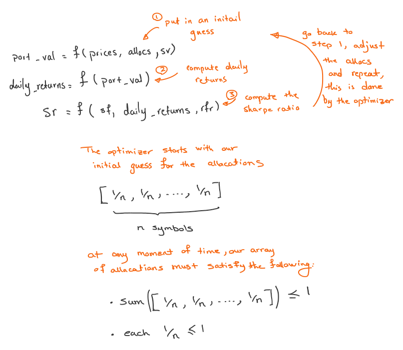
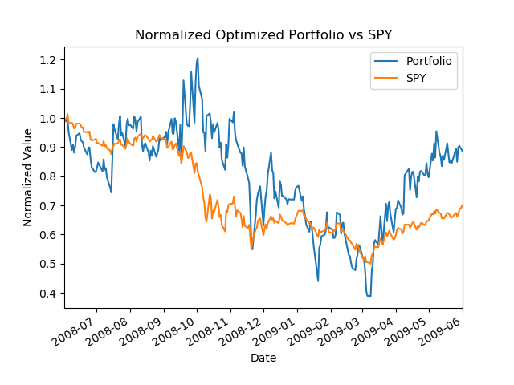
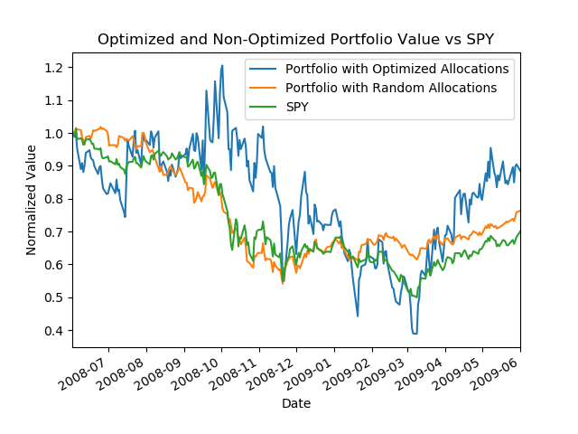

## Introduction

This article builds upon Part 1 and shows how portfolio stock allocations can be optimized using Python SciPy library, the primary learning goals are:

- **Portfolio Optimization:** Starting with an initial guess, learn how to optimize stock allocations for a portfolio and compare the results with the non-optimized case.

## Problem Statement and Solution

The goal is to use an initial guess for stock allocations and then optimize the portfolio for Sharpe ratio. Starting with a few important points to frame the problem.

- For the initial guess given there are N symbols, allocate to each symbol 1/N stocks
- During optimization ensure the sum of allocations won't exceed 1 (bounds)
- When allocating stocks it is not possible to allocate more than 1 (constraints)
- For all purposes of calculations we assume a daily sampling frequency of 252, and a risk free rate of return of 0

The idea here is to write a function that given certain inputs will calculate the Sharpe ratio, then ask SciPy optimization module to call this function repeatedly until an optimal value is reached. From previous article we know maximizing Sharpe ratio is desired since it means the standard deviation of the daily value of the portfolio is minimum, thus low risk while the expected value of the returns is maximum.

The problem can then be defined as:

- Provide a function to minimize
- Provide an initial guess
- Call the optimizer

However, if we ask Python to minimize the Sharpe ratio it will try to find the maximum value by maximizing the denominator, which will be the exact opposite of our goal, since that would mean finding a minimum value for Sharpe ratio where the standard deviation is highest. To overcome this problem, instead of calling our optimizer to minimize Sharpe ratio we call it to minimize Sharpe ratio multiplied by -1.




Now, the solution. We need a function to call repeatedly to compute the Sharpe ratio. Using the material from previous article, we can define such a function easily.

```python
def compute_sharpe_ratio(allocs, prices, sv=1, rfr=0., sf=252.):
    """
    Compute Sharpe ratio

    Args:
        allocs (list): A list of stock allocations, must sum to 1
        prices (DataFrame): A n*m pandas dataframe where n is an index of dates and m is a set of stock symbol prices
        sv (integer): Starting value of the portfolio, for Sharpe ratio calculations the actual value does not matter, since it gets normalized
        rfr (float): Risk free return rate
        sf (float): Sampling frequency, daily=252, weekly=52, monthly=12
    """
    port_val = compute_portfolio_daily_value(prices, allocs, sv)
    daily_returns = compute_portfolio_daily_returns(port_val)
    sr = math.sqrt(sf) * (daily_returns - rfr).mean() / daily_returns.std()

    return sr


def find_optimized_allocations(init_allocs, prices):
    """
    Find optimized allocations

    Args:
        init_allocs (list): A list of initial stock allocations, must sum to 1
        prices (DataFrame): A n*m pandas dataframe where n is an index of dates and m is a set of stock symbol prices
    """
    def _compute_sharpe_ratio(allocs, prices):
        return compute_sharpe_ratio(allocs, prices) * -1 # we multiply by -1 so that SciPy finds the maximum

    constraints = (
        {'type': 'eq', 'fun': lambda x: np.sum(x) - 1}
    )
    bounds = [(0, 1) for _ in range(len(init_allocs))]
    optimized_allocs = scpo.minimize(
        _compute_sharpe_ratio,
        init_allocs,
        args=(prices, ),
        method='SLSQP',
        constraints=constraints,
        bounds=bounds
    )

    return optimized_allocs
```

Similar to previous article we put everything together and call our optimization code.

```python
import datetime as dt
import numpy as np
import math
import matplotlib.pyplot as plt
import pandas as pd
from util import get_data
import scipy.optimize as scpo

from optimize_something.assess_portfolio import compute_portfolio_daily_returns, compute_portfolio_daily_value, compute_portfolio_stats


def compute_sharpe_ratio(allocs, prices, sv=1, rfr=0., sf=252.):
    """
    Compute Sharpe ratio

    Args:
        allocs (list): A list of stock allocations, must sum to 1
        prices (DataFrame): A n*m pandas dataframe where n is an index of dates and m is a set of stock symbol prices
        sv (integer): Starting value of the portfolio, for Sharpe ratio calculations the actual value does not matter, since it gets normalized
        rfr (float): Risk free return rate
        sf (float): Sampling frequency, daily=252, weekly=52, monthly=12
    """
    port_val = compute_portfolio_daily_value(prices, allocs, sv)
    daily_returns = compute_portfolio_daily_returns(port_val)
    sr = math.sqrt(sf) * (daily_returns - rfr).mean() / daily_returns.std()

    return sr


def find_optimized_allocations(init_allocs, prices):
    """
    Find optimized allocations

    Args:
        init_allocs (list): A list of initial stock allocations, must sum to 1
        prices (DataFrame): A n*m pandas dataframe where n is an index of dates and m is a set of stock symbol prices
    """
    def _compute_sharpe_ratio(allocs, prices):
        return compute_sharpe_ratio(allocs, prices) * -1 # we multiply by -1 so that SciPy finds the maximum

    constraints = (
        {'type': 'eq', 'fun': lambda x: np.sum(x) - 1}
    )
    bounds = [(0, 1) for _ in range(len(init_allocs))]
    optimized_allocs = scpo.minimize(
        _compute_sharpe_ratio,
        init_allocs,
        args=(prices, ),
        method='SLSQP',
        constraints=constraints,
        bounds=bounds
    )

    return optimized_allocs


def optimize_portfolio(
    symbols,
    sd=dt.datetime(2008, 1, 1),
    ed=dt.datetime(2009, 1, 1),
    gen_plot=False
):
    """
    Optimize a portfolio of stocks allocations

    Args:
        symbols (list): A list of stock symbols
        sd (datetime): Starting datetime
        ed (datetime): Ending datetime
        gen_plot (bool): Toggle to generate plot
    """
    prices_all = get_data(symbols=symbols, dates=(sd, ed))
    prices = prices_all[symbols]
    prices_SPY = prices_all['SPY']

    init_allocs = [1 / len(symbols) for _ in range(len(symbols))]
    
    # find the allocations for the optimal portfolio
    allocs = find_optimized_allocations(init_allocs, prices)
    # Get daily portfolio value and returns
    port_val = compute_portfolio_daily_value(prices, allocs.x, sv=1)
    daily_returns = compute_portfolio_daily_returns(port_val)

    # Get portfolio statistics (note: std_daily_ret = volatility)
    cr, adr, sddr, sr = compute_portfolio_stats(port_val, daily_returns, sf=252, rfr=0)

    # Compare daily portfolio value with SPY using a normalized plot
    if gen_plot:
        # add code to plot here
        df_temp = pd.concat(
            [(port_val / port_val[0]), (prices_SPY / prices_SPY[0])], keys=["Portfolio", "SPY"], axis=1
        )
        df_temp.plot()
        plt.title("Normalized Optimized Portfolio vs SPY")
        plt.xlabel("Date")
        plt.ylabel("Normalized Value")
        plt.savefig('./optimized.png')

    return allocs.x, cr, adr, sddr, sr


if __name__ == "__main__":
    start_date = dt.datetime(2008, 6, 1)
    end_date = dt.datetime(2009, 6, 1)
    symbols = ["IBM", "X", "GLD", "JPM"]

    # Assess the portfolio  		  	   		  	  		  		  		    	 		 		   		 		  
    allocations, cr, adr, sddr, sr = optimize_portfolio(
        sd=start_date, ed=end_date, symbols=symbols, gen_plot=True
    )

    # Print statistics  		  	   		  	  		  		  		    	 		 		   		 		  
    print(f"Start Date: {start_date}")
    print(f"End Date: {end_date}")
    print(f"Symbols: {symbols}")
    print(f"Allocations:{allocations}")
    print(f"Sharpe Ratio: {sr}")
    print(f"Volatility (stdev of daily returns): {sddr}")
    print(f"Average Daily Return: {adr}")
    print(f"Cumulative Return: {cr}")
```
Running the optimization for the sample data in the code above generates the following chart. We can see the effect of the optimization where the price of SPY has plunged while our Portfolio increased in value.



What is even more interesting is to compare the case of an optimized stock allocation with a random stock allocation. In the code example below, the compare function does exactly that. It is clear the optimized stock allocations is performing much better compared to a random allocation of stock.



```python
def compare(
    symbols,
    rand_allocs,
    sd=dt.datetime(2008, 1, 1),
    ed=dt.datetime(2009, 1, 1),
    gen_plot=False
):

    prices_all = get_data(symbols=symbols, dates=(sd, ed))
    prices = prices_all[symbols]
    prices_SPY = prices_all['SPY']

    # the optimum allocations
    init_allocs = [1 / len(symbols) for _ in range(len(symbols))]
    # find the allocations for the optimal portfolio
    opt_allocs = find_optimized_allocations(init_allocs, prices)
    # Get daily portfolio value and returns
    opt_port_val = compute_portfolio_daily_value(prices, opt_allocs.x, sv=1)
    opt_daily_returns = compute_portfolio_daily_returns(opt_port_val)

    # Get portfolio statistics (note: std_daily_ret = volatility)
    opt_cr, opt_adr, opt_sddr, opt_sr = compute_portfolio_stats(opt_port_val, opt_daily_returns, sf=252, rfr=0)

    # random allocations
    # Get daily portfolio value and returns
    rand_port_val = compute_portfolio_daily_value(prices, rand_allocs, sv=1)
    rand_daily_returns = compute_portfolio_daily_returns(rand_port_val)

    # Get portfolio statistics (note: std_daily_ret = volatility)
    rand_cr, rand_adr, rand_sddr, rand_sr = compute_portfolio_stats(rand_port_val, rand_daily_returns, sf=252, rfr=0)

    if gen_plot:
        df_temp = pd.concat(
            [
                (opt_port_val / opt_port_val[0]),
                (rand_port_val / rand_port_val[0]),
                (prices_SPY / prices_SPY[0])
            ],
            keys=[
                "Portfolio with Optimized Allocations",
                "Portfolio with Random Allocations",
                "SPY"
            ],
            axis=1
        )
        df_temp.plot()
        plt.title("Optimized and Non-Optimized Portfolio Value vs SPY")
        plt.xlabel("Date")
        plt.ylabel("Normalized Value")
        plt.savefig('./compare.png')

    return {
        'random': dict(
            rand_allocs=rand_allocs,
            rand_cr=rand_cr,
            rand_adr=rand_adr,
            rand_sr=rand_sr
        ),
        'optimized': dict(
            opt_allocs=opt_allocs,
            opt_cr=opt_cr,
            opt_adr=opt_adr,
            opt_sr=opt_sr
        )
    }
```