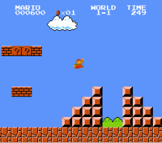
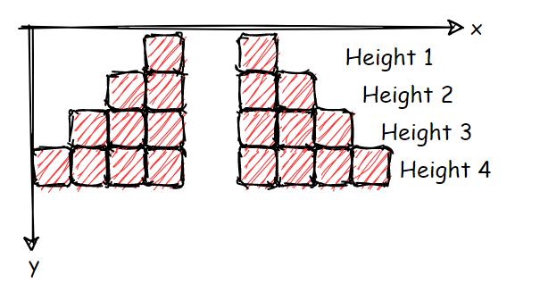

## Introduction

CS50 is one of the most well known and prestigious courses on computer science. The course is offered by Harvard University faculty and based on Edx it has already more than 2.8 millions enrolled students.

I was going through their material on the [CS50x](https://cs50.harvard.edu/x/2021/) [website](https://cs50.harvard.edu/x/2021/), and I came across an interesting Python problem. Citing from the course materials in [Problem Set 6](https://cs50.harvard.edu/x/2021/psets/6/), the students are asked the following:

>[!info] Mario
>
>Implement a program the prints out a double half-pyramid of a specified height.
>
>


The output of such a program will look similar to the blocks and structures in the Mario game. So, for example running the program with height set to 4 would produce the following:

Height: 4
```
      #    #
     ##    ##
    ###    ###
   ####    ####
```

The code for this article can be found at:

- [Code](https://gist.github.com/pmesgari/f085a7852d46226079d8dae3a44089e7)
- [Test](https://gist.github.com/pmesgari/aed32a732d265874b0717cbe65e30448)

## Specifications and Tests

Our solution must be compliant with the specifications asked below:

- A valid height is an integer between 1 and 8 inclusive
- The program prompts the user for the height, if an invalid value is given, the user is asked again until a valid height is entered
- The program generates and outputs the desired half-pyramids

We are also given a collection of tests to help us in writing and verifying the behavior of our code, for sake of ease so that you don't have to move back and forth between windows, I list the test specifications directly from the course website:

- Run your program as `python mario.py` and wait for a prompt for input. Type in `-1` and press enter. Your program should reject this input as invalid, as by re-prompting the user to type in another number.
- Run your program as `python mario.py` and wait for a prompt for input. Type in `0` and press enter. Your program should reject this input as invalid, as by re-prompting the user to type in another number.
- Run your program as `python mario.py` and wait for a prompt for input. Type in `1` and press enter. Your program should generate the below output. Be sure that the pyramid is aligned to the bottom-left corner of your terminal, and that there are no extra spaces at the end of each line.

#  #

- Run your program as `python mario.py` and wait for a prompt for input. Type in `2` and press enter. Your program should generate the below output. Be sure that the pyramid is aligned to the bottom-left corner of your terminal, and that there are no extra spaces at the end of each line.

```
 #  #
##  ##
```
 
- Run your program as `python mario.py` and wait for a prompt for input. Type in `8` and press enter. Your program should generate the below output. Be sure that the pyramid is aligned to the bottom-left corner of your terminal, and that there are no extra spaces at the end of each line.
```
       #  #
      ##  ##
     ###  ###
    ####  ####
   #####  #####
  ######  ######
 #######  #######
########  ########

```

- Run your program as `python mario.py` and wait for a prompt for input. Type in `9` and press enter. Your program should reject this input as invalid, as by re-prompting the user to type in another number. Then, type in `2` and press enter. Your program should generate the below output. Be sure that the pyramid is aligned to the bottom-left corner of your terminal, and that there are no extra spaces at the end of each line.

```
 #  #
##  ##
```

- Run your program as `python mario.py` and wait for a prompt for input. Type in `foo` and press enter. Your program should reject this input as invalid, as by re-prompting the user to type in another number.
- Run your program as `python mario.py` and wait for a prompt for input. Do not type anything, and press enter. Your program should reject this input as invalid, as by re-prompting the user to type in another number.

## Solution Approach

So, this is an interesting and fun program to write, how should we begin?

Taking a close look at the pyramid's the first thing that captures attention is the symmetry between left and right halves. Can we use this symmetry to our advantage? Yes!

We can think of each layer in the pyramid as a sequence of characters, for example 0s and 1s. This allows us to quickly see the pattern and help us in writing the code. For example the pyramid of height 4 can have the following string representation:

Height: 4
```
      #    #     0001001000 
     ##    ##    0011001100
    ###    ###   0111001110
   ####    ####  1111001111
```

Now, next question is how can we generate such a string representation? Before we dive into the details of the implementation lets create an action plan. Looking at the strings above it is easy to see the symmetry, that is right half is always reverse of the left half. And finally the gap connects the two halves. Thus, our most important finding is: **Right is reverse of the Left.**

>[!info] Algorithm
>
>1. Make the left half  
>2. Make the right half by reversing the left half  
>3. Merge left and right  
>4. Insert the gap


We can write a pseudo code that generates the left half as such:

```python
for i in range(height)
    if i >= pivot - height
        left = left + 1
    else
        left = left + 0
```
The loop above executes per layer of the pyramid. We have introduced a variable called `pivot`, this is simply the halfway point determining the gap location, or in other words the `pivot` determines the length of the string. But, we also want to keep the gap size flexible, so we have to keep that in mind when we write the actual implementation. In each iteration we determine the 0s and 1s in the string by comparing the iteration index `i` with the simple formula `pivot - layer`. This allows us to determine how many 0s and 1s we need at each layer. Although simple, but this is really the core of our application. So, let's go ahead and write code and tests to deliver it.

It is important to realize how we define height. To do that imagine a coordinate system with its y axis at the top of the pyramid and its positive direction towards the bottom of the pyramid. Also, note that height starts at 1.



Lets begin with a writing a test and the code to make it pass.

```python
def test_make_pyramid_layer_with_valid_integer():
    assert make_pyramid_half(height=1, pivot=1) == '1'
    assert make_pyramid_half(height=1, pivot=2) == '01'
    assert make_pyramid_half(height=1, pivot=3) == '001'
    assert make_pyramid_half(height=1, pivot=4) == '0001'
    assert make_pyramid_half(height=2, pivot=4) == '0011'
    assert make_pyramid_half(height=3, pivot=4) == '0111'
    assert make_pyramid_half(height=4, pivot=4) == '1111'
```

We have a function that we can call by passing the `height` we are at and the location of the `pivot`. Writing the code to pass the test is easy.

```python
def make_pyramid_half(height, pivot):
    half = ''
    for i in range(pivot):
        if i >= pivot - height:
            half = half + '1'
        else:
            half = half + '0'
    return half
```

So, now at any given `height` we are able to determine the half string representation of the pyramid. Important to remember is **our coordinate axis**, that determines which half of the pyramid are we generating. In the code above, we are generating the **left half** of our pyramid. To complete the core of our application we need to have a way to generate all the layers at once. Again, we start with writing our test.

```python
def test_make_pyramid_with_valid_height():
    assert make_pyramid(height=1, gap_size=1) == [
        '1g1'
    ]
    assert make_pyramid(height=3, gap_size=1) == [
        '001g100',
        '011g110',
        '111g111'
    ]
    assert make_pyramid(height=4, gap_size=1) == [
        '0001g1000',
        '0011g1100',
        '0111g1110',
        '1111g1111',
    ]
```

And here is code to pass the tests.

```python
def make_pyramid(height, gap_size):
    pivot = height
    pyramid = []
    for i in range(1, height + 1):
        left_half = make_pyramid_half(height=i, pivot=pivot)
        right_half = ''.join(reversed(left_half))
        gap = 'g' * gap_size
        layer = f'{left_half}{gap}{right_half}'
        pyramid.append(layer)

    return pyramid
```

The code should be self-explanatory, we simply make two halves, the gap and then combine them all to make a full layer. Looking back at our action plan, we have completed all the steps. Now is the time to write the code that prints the output.

It is important to understand the relation between the gap size and blocks. We can't use 0s to represent the gap size, because we are already using 0s to represent the empty blocks. If we would use 0s to represent the gap size, and the empty blocks, using a gap size of 2 we would end up with something like this:

```
       #     #
     ##       ##
   ###         ###
 ####           ####
```
 ####           ####

As you can see our pyramid is sort of skewed. But using a specific symbol for the gap which is not the same as the empty block resolves this issue.

Finally, here is the code that puts everything together.

```python
def replace_multiple(string, replacements):
    result = string
    for r in replacements:
        result = result.replace(r[0], r[1])
    return result


def draw_pyramid(pyramid, block='#', gap='  '):
    for layer in pyramid:
        l = replace_multiple(layer, [('1', block), ('0', gap), ('g', gap)])
        print(l)
```

This completed the core of our application, we can now draw pyramids. However, going back to our specifications, we are asked to develop a CLI interface that takes the `height` from the user and draws the pyramid. The CLI is responsible to make sure the data going into our application is valid and clean.

>[!note]
>**Validate** and clean your data on **the edges** of your application as much as possible. This allows the core of the system to stay clean and focus only on what matters, which is the **domain logic**.

Here is the final piece of our application.

```python
def cli():
    try:
        height = int(input('Enter height: '))
        gap_size = int(input('Enter gap size: '))
        if height not in range(1, 9):
            print('height must be between 1 and 9')
        elif gap_size <= 0:
            print('gap size must be a positive integer')
        else:
            pyramid = make_pyramid(height, gap_size)
            draw_pyramid(pyramid)
    except ValueError:
        print('height and gap size must be integers')


if __name__ == '__main__':
    try:
        while True:
            cli()
    except KeyboardInterrupt:
        print('Thank you for using Mario!')
        exit()
```

Even though our code is short, and simple there are many interesting aspects of learning about it. For example, understanding character size and its relation to the gap size, or handling validation at the edges.