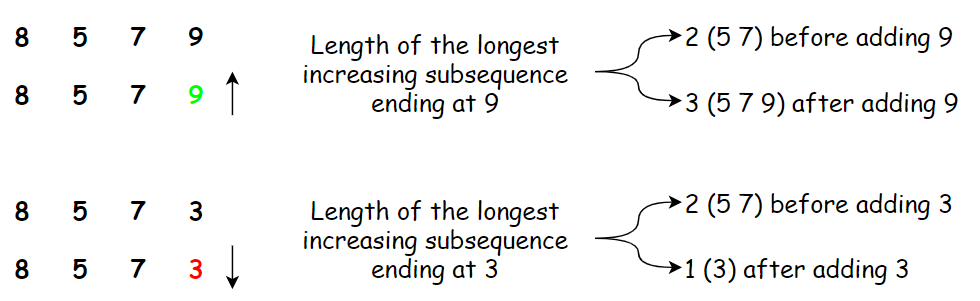

Awhile ago I came across an interesting programming exercise at work. There is an external system that is integrated with our application. There are several API calls being made to it, one of which requires setting a password field. The external system enforces a set of rules for acceptable passwords. There are the usual rules such as a password cannot be the user's phone number, or the reversed old password and so on. But there is a rule that caught my attention, it states:

> A password cannot contain more than 3 sequentially ascending digits or 3 sequentially descending digits.

This sounded to me very similar to the famous **longest increasing subsequence** problem. So, in this articles I will try to go through the steps and provide an algorithmic implementation.

## Variations

There are many variations of the longest increasing subsequence problem, almost all share the same basic but a few differences here and there. Since the increasing or decreasing property are almost identical, I will be focusing only on the increasing variations:

- Longest continuously increasing subsequence
- Longest increasing subsequence
- Longest sequentially increasing subsequence

I start with implementing the most simple variation, the longest continuously increasing subsequence.

## Longest Continuously Increasing Subsequence

The longest continuously increasing subsequence is a simple flavor of the general longest increasing subsequence.

>[!info] Algorithm
>**Description:** Given a sequence of n elements a1 a2 a3…ana1​ a2​ a3​…an​, find the longest continuously increasing _subsequence_. A _subsequence_ is any subset of the elements taken in order and contiguously, of the form ai1 ai2…aikai1​​ ai2​​…aik​​ where 1≤i1<i2<i3…ik≤n1≤i1​<i2​<i3​…ik​≤n. An _increasing subsequence_ is one in which the numbers are getting strictly larger, that is for every aiai​ in the subsequence we have ai>ai−1ai​>ai−1​  
>
>**Input:** A sequence of numbers in the form a1 a2 a3…ana1​ a2​ a3​…an​  
>
>**Output:** Length of the longest continuously increasing subsequence


Every time we have a problem to solve where it is a matter of maximizing or minimizing a certain property, **dynamic programming** can be an effective approach. We are going to apply dynamic programming to solve our problem.

>[!info] The Dynamic Programming Paradigm
>1. Identify a relatively small collection of subproblems.  
>2. Show how to quickly and correctly solve "larger" subproblems given the solutions to "smaller" ones. 
>3. Show how to quickly and correctly infer the final solution from the solutions to all of the subproblems.


The key to applying dynamic programming techniques lies in identifying the optimal _overlapping_ subproblems. Here _overlapping_ means we are able to solve the larger subproblem by knowing the solution to the smaller subproblems, in other words our subproblems are constructed from the smaller subproblems.

Another important note is that we need to also specify the optimal solution to our subproblems. Because without knowing the optimal solution of the smaller subproblems we are not able to construct an optimal solution to the larger subproblems.

We begin by defining our subproblems like so:

- Find the longest increasing subsequence in a1a1​ ending in a1a1​
- Find the longest increasing subsequence in a1 a2a1​ a2​ ending in a2a2​
- Find the longest increasing subsequence in a1 a2 …an−1a1​ a2​ …an−1​ ending in an−1an−1​
- Find the longest increasing subsequence in a1 a2 …an−1 ana1​ a2​ …an−1​ an​ ending in anan​

With our subproblems defined, we can now try to define a method for finding the optimal solutions. As we go along and construct our subproblems, we have a **decision to make**. Do we include the last element of the subsequence or not?

>[!note]
>
>Remember our goal at each subproblem is to **find an optimal solution**. Thus, when looking at any subsequence, we can assume the optimal solution either contains the last element of the subsequence or it doesn't. This is where the **magic happens!**

When we have our subproblems and a definition of optimal solutions, it is time to define the **recurrence relation**. Since we are aiming to solve larger subproblems from the smaller subproblems, we have to define a **recurrence relation**.

>[!info] Base Case and Recurrence
>
>To begin with finding the recurrence, it is best to start with our base case.  
>
>**Base case:** We define our base case to be the first subproblem, that is finding the largest continuously increasing subsequence for the subsequence a1a1​ ending in a1a1​. It is obvious the length of such increasing subsequence is `1` since there is only one element.  
>
>**Recurrence:** We mentioned previously at every subproblem we have a decision to make, does adding the last element of the subsequence bring us to an optimized solution or not? Now, let's formulate this in a more precise and structured fashion.  
>
>```
>LCIS(aj)={LCIS(aj−1)+1if aj>aj−11else}LCIS(aj​)={​LCIS(aj−1​)+11​if aj​>aj−1​else​}
>```


Thus, if adding the last element brings us to an optimized solution, our longest continuously increasing subsequence is what has been our longest continuously increasing subsequence excluding the last element plus 1. Look at the examples below, in the first subsequence, adding the last element increases the length of our longest continuously increasing subsequence, and so we should do that! However, in the second example, adding the last element doesn't bring us any benefit. Which also means, the length of our longest continuously increasing subsequence which ends at 3 is just 1!.


With our definition of **subproblem, optimized solution and recurrence** in place, it is now time verify the correctness of our solution.

To prove our solution, we will be using induction, for those interested in the mathematical concepts behind induction and in general an amazing mathematics resource for computer science, the [Mathematics for Computer Science](https://ocw.mit.edu/courses/electrical-engineering-and-computer-science/6-042j-mathematics-for-computer-science-spring-2015/index.htm) course offered by Prof. Meyer at MIT is **highly recommended**. The course has a wealth of material and a comprehensive online text book.

>[!info] The Induction Principle
>
>Let PP be a predicate on nonnegative integers. If  
>
>1. P(0)P(0) is true, and  
>
>2. P(n) implies P(n+1)P(n) implies P(n+1) for all nonnegative integers then
>
>P(m)P(m) is true for all nonnegative integers


Let's apply the induction principle to our solution.

>[!info] LCIS Algorithm
>
> We use induction to proof our hypothesis that the following equation can be used to find the longest continously increasing subsequence for any nonnegative sequence of integers:  
  >
>LCIS(aj)={LCIS(aj−1)+1if aj>aj−11else}LCIS(aj​)={​LCIS(aj−1​)+11​if aj​>aj−1​else​}  
  >
>**Base case:** In our base case we will proof that for a sequence of length 11 the length of the longest continuously increasing subsequence is 11. This is obvious, if our sequence contains a single element, then our longest continuously increasing subsequence is just 11.  
  >
>**Inductive step:** We assume that LCIS(aj)LCIS(aj​) is true, then we have two cases to consider:  
  >
>1. if aj<aj+1aj​<aj+1​ then the length of the longest continuously increasing subsequence ending in aj+1aj+1​ is the length of the longest continuously increasing subsequence ending in ajaj​ plus 11. Which means LCIS(aj+1)=LCIS(aj)+1LCIS(aj+1​)=LCIS(aj​)+1.  
>  
>2. if aj>aj+1aj​>aj+1​ then the length of the longest continuously increasing subsequence ending in aj+1aj+1​ is just 11, meaning LCIS(aj+1)=1LCIS(aj+1​)=1.  
>

Thus, our recurrence relation holds and LCIS(aj)LCIS(aj​) is correct.

We are now set to write the algorithm for finding the length of the longest continuously increasing subsequence.

>[!info] Recurrence Relation
>
>```A ←emptylistA[1]←1for j from 2 to n:if aj>aj−1:A[j]←A[j−1]+1elseA[j]←1return A
>A ←emptylistA[1]←1for j from 2 to n:if aj​>aj−1​:A[j]←A[j−1]+1elseA[j]←1return A​

The algorithm should be self explanatory. We start by initializing a list and then iterate over all the elements of the subsequence. At each iteration we solve the subproblem using the answers of the previous subproblems.

We can simply implement the algorithm above in Python. For the purpose of this article, I am assuming the input of our interest is a string of digits. This is slightly different situation compared to having an input representing an actual sequence of digits. Most important difference is when we deal with a sequence of digits as a string, we only have numbers from 0…90…9, however an actual sequence can span the entire range of nonnegative integers. However, this difference won't affect our algorithm and solution.

We begin with writing our test cases.

```python
def test_lcis():
    assert lcis('') == 0
    assert lcis('1') == 1
    assert lcis('12') == 2
    assert lcis('21') == 1
    assert lcis('11111') == 1
    assert lcis('23194679') == 4  # (4, 6, 7, 9)
    assert lcis('236733213') == 4  # (2, 3, 6, 7)
    assert lcis('285247892109') == 5  # (2, 4, 7, 8, 9)
```

Our tests are verifying the behavior of the algorithm at the boundaries as well as finding the actual longest continuously increasing subsequence. Here is the implementation satisfying the above tests:

```python
def _lcis(arr):
    if not arr:
        return 0

    a = [1]
    for i in range(1, len(arr)):
        if arr[i] > arr[i-1]:
            a.append(a[i-1] + 1)
        else:
            a.append(1)
    return max(a)


def lcis(s):
    return _lcis(list([int(e) for e in s]))
```

We use a simple wrapper function `lcis` such that our users don't need to worry about transforming their string of integers to a list of integers.

So, here it is, our solution to finding the longest continuously increasing subsequence.

## Resources

1. _Algorithms Illuminated Part3: Greedy algorithms and dynamic programming, Tim Roughgarden_
2. _Mathematics for Computer Science, Eric Lehman, F.Thomson Leighton, Albert R. Meyer_

