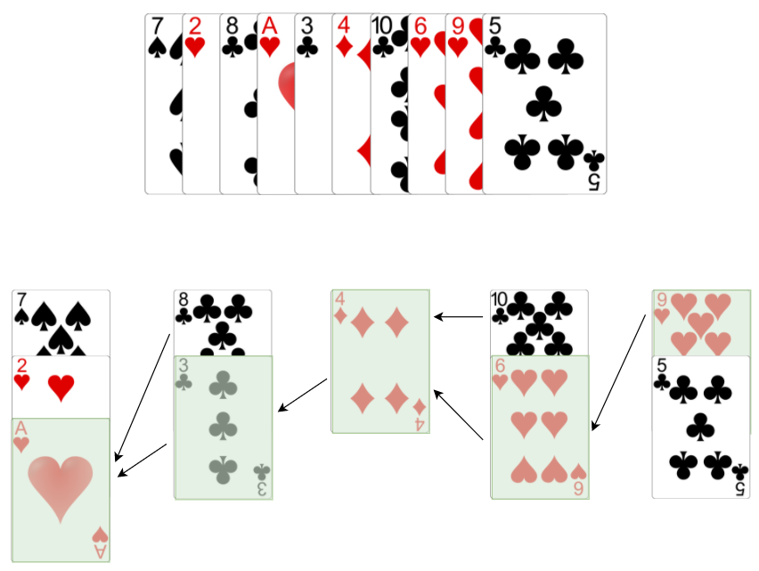

In the previous article we showed the algorithm for finding the longest continuously increasing subsequence. Now, we try to find the longest increasing subsequence and drop the contiguous requirement. First we begin with a formal definition of the problem.

>[!info] Algorithm Description
>
 >**Description:** Given a sequence of n elements a1 a2 a3…ana1​ a2​ a3​…an​, find the longest continuously increasing _subsequence_. A _subsequence_ is any subset of the elements taken in order, of the form ai1 ai2…aikai1​​ ai2​​…aik​​ where 1≤i1<i2<i3…ik≤n1≤i1​<i2​<i3​…ik​≤n. An _increasing subsequence_ is one in which the numbers are getting strictly larger, that is for every aiai​ in the subsequence we have ai>ai−1ai​>ai−1​.  
  >
>**Input:** A sequence of numbers in the form a1 a2 a3…ana1​ a2​ a3​…an​  
>
>**Output:** Length of the longest continuously increasing subsequence

Removing the contiguous requirement brings some interesting challenges in solving the longest increasing subsequence problem. We first begin with the mathematical preliminaries.

## Mathematical Preliminaries

One of the main papers about longest increasing and decreasing subsequences is published by C.Schensted in 19611. The paper is interesting to read although mathematically intense. The reader must understand the concept of Young tableau and its properties.

The algorithm we will use is called **Patience Sorting** which is inspired by the card game patience. The concept is straightforward.

The patience sorting algorithm can be used to determine the length of the longest increasing subsequence. This is best explained in the paper _Longest Increasing Subsequences: From Patience Sorting to the Baik-Deift-Johansson Theorem_2.

Once the patience sorting algorithm is applied we will have a certain number of piles, this number is equal to the length of the longest increasing subsequence.

>[!info] Theory
>Define l(π)l(π) to be the length of the longest increasing subsequence of a permutation ππ.  
>  
>**Lemma:** With deck ππ, patience sorting played with the greedy strategy ends with exactly l(π)l(π) piles. Furthermore, the game played with any legal strategy ends with at least l(π)l(π) piles. So the greedy strategy is optimal, and cannot be improved by any look-ahead strategy.  
>
>**Proof:** If cards a1 a2 a3…ala1​ a2​ a3​…al​ appear in increasing order, then under any legal strategy each aiai​ must be placed in some pile to the right of the pile containing ai−1ai−1​, because the card number on top of that pile can only decrease. Thus, the final number of piles is at least ll, and hence at least l(π)l(π). Conversely, using the greedy strategy, when a card cc is placed in a pile other than the first pile, put a pointer from that card to the currently top card c′<cc′<c in the pile to the left. At the end of the game, let alal​ be the card on top of the rightmost pile ll. The sequence a1←a2←⋯←al−1←ala1​←a2​←⋯←al−1​←al​ obtained by following the pointers is an increasing subsequence whose length is the number of piles.
>
>The proof and definition of patience sorting from *Longest Increasing Subsequence: From Patience Sorting to Baik-Deift-Johansson Theorem*.

The example below displays how the patience sort is applied and the resulting longest increasing subsequence. We assume Ace has a value of 1.



We now have a solution that we can implement.

## Implementation

To find the length of the longest increasing subsequence we must implement the patience sorting algorithm. While we studies the sorting algorithm we realized a greedy strategy is required to find the leftmost legal pile. Thus, we are also going to need some sort of search algorithm to help us doing that.

To find the leftmost pile, we will implement the binary search algorithm. We also require a way to model the pile itself. For doing that we create a simple stack data structure that allows us to push and peak into it. Once our piles are formed, we readily know the length of the longest increasing subsequence. However, how do we actually determine the subsequence elements? Going back to our proof we need to store a sequence of pointers and later backtrack them in order to get the actual subsequence elements.

So, our action plan is:

- Model the piles using stack data structures
- Implement a binary search algorithm to find the leftmost pile
- Implement the patience algorithm itself
- Implement a backtrack method to print out the longest increasing subsequence

## Implementing the Stack and Pile

Implementing a stack is straightforward. The most interesting characters of stack are its **size** and **top** element. Furthermore we need to be able to push a new element to the stack as well as pop an element from it. As usual we start by writing our test cases.

```python
from stack import Stack


def test_push_to_stack():
    s = Stack()
    s.push(10)
    s.push(2)

    assert s.size == 2
    assert s.is_empty is False


def test_pop_from_stack():
    s = Stack()
    s.push(4)
    s.push(1)

    s.pop()
    assert s.size == 1
    assert s.is_empty is False

    s.pop()
    assert s.is_empty is True


def test_peek_into_stack():
    s = Stack()
    s.push(4)
    s.push(3)
    s.push(10)

    assert s.top == 10
    s.pop()
    assert s.top == 3
```

These few test cases guarantee the functionality of our stack as expected. This is the code we need to pass these tests.

```python
class Stack:
    def __init__(self):
        self.elements = []

    @property
    def size(self):
        return len(self.elements)

    @property
    def is_empty(self):
        return len(self.elements) == 0

    def push(self, e):
        self.elements.append(e)

    @property
    def top(self):
        if self.is_empty:
            return None
        return self.elements[-1]

    def pop(self):
        if self.is_empty:
            return None
        self.elements = self.elements[:-1]


```

When we are going to write our patience algorithm we must be able to compare piles. I took advantage of Python's operator overloading capabilities and decided to create a specific data structure based on the stack that allows comparisons. When we are comparing a pile to another one all we care about is the top element. So, I make a specific class to represent a pile and override its operator methods.

Starting with our test cases to define what we are trying to achieve.

```python
def test_piles_equal_operator():
    p1 = Pile()
    p1.push(1)
    p2 = Pile()
    p2.push(1)
    assert p1 == p2


def test_piles_lt_operator():
    p1 = Pile()
    p1.push(4)
    p2 = Pile()
    p2.push(2)
    assert p1 > p2


def test_piles_gt_operator():
    p1 = Pile()
    p1.push(4)
    p2 = Pile()
    p2.push(2)
    assert p2 < p1

class Pile(Stack):
    def __init__(self):
        super().__init__()

    def __eq__(self, other):
        return self.top == other

    def __gt__(self, other):
        return self.top > other

    def __lt__(self, other):
        return self.top < other

    def __repr__(self):
        return f"Pile: {self.top}"
```

The tests and the code should be self-explanatory. Most important to understand is that as long as the `other` object is implementing the same operator functions we can compare it to our object.

>[!info] Note
>This might seem strange at first, because comparing stacks per se doesn't make much sense. A stack is just a mechanism to store information. But, remember **modelling the domain** and the **problem** is **critical**. Within our context we are dealing with piles, and it is allowed and needed to compare piles in order to place the cards in the correct pile. A stack is just an easy to use and implement data structure that allows us to model a pile.

## Implementing the Binary Search

Binary search is an efficient and easy to implement searching algorithm that runs in O(log n)O(log n) since it halves the number of elements at each step. What is important is that our binary search algorithm must ensure returning the leftmost pile. That comes down to how we choose the mid point for our search. Depending on the length we might have to deal with an even or odd number, as soon as we have an odd number we will take the floor of the mid point to ensure the rightmost element is returned.

```python
def test_binary_search_leftmost():
    assert binary_search_leftmost([], 4) == 0
    assert binary_search_leftmost([1], 0) == 0
    assert binary_search_leftmost([1, 2], 3) == 2
    assert binary_search_leftmost([1], 1) == 0
    assert binary_search_leftmost([1, 2, 3, 5], 4) == 3
    assert binary_search_leftmost([2, 3, 6, 8, 10], 9) == 4
    assert binary_search_leftmost([2, 3, 6, 8, 10], 12) == 5
```

Our test cases are checking for boundary conditions such as empty list, one element list, inserting at the beginning, end, middle and anywhere else.

```python
def binary_search_leftmost(elements, target):
    left = 0
    right = len(elements)

    while left < right:
        mid = (left + right) // 2
        if elements[mid] < target:
            left = mid + 1
        else:
            right = mid
    return left
```

I like to mention a point about the division we see for determining the mid. In Python the usual divisor operator is `/` however, we also have the double `//` divisor operator. The double will only return the integer part of the number. That effectively means we always have the floor when calculating the mid point.

## Implementing the Patience Sorting

Now, we have all the elements we need to implement the actual patience sorting algorithm itself. We write a few tests to check our algorithm.

```python
def test_patience():
    assert patience([])[0] == 0
    assert patience([1])[0] == 1
    assert patience([1, 2, 3, 4, 5, 6, 7, 8, 9])[0] == 9
    assert patience([6, 3, 5, 10, 11, 2, 9, 14, 13, 7, 4, 8, 12])[0] == 5
    assert patience([7, 2, 8, 1, 3, 4, 10, 6, 9, 5])[0] == 5
```

And here comes the final implementation.

```python
def patience(values: [int]):
    piles = []
    pointers = {}
    for val in values:
        leftmost_index = binary_search_leftmost(piles, val)
        if leftmost_index > len(piles) - 1 or len(piles) == 0:
            leftmost_pile = Pile()
            piles.append(leftmost_pile)
        else:
            leftmost_pile = piles[leftmost_index]
        leftmost_pile.push(val)

        if leftmost_index != 0:
            prev = piles[leftmost_index - 1]
            curr = leftmost_pile.top
            pointers[curr] = prev.top
    return len(piles), pointers
```

The code is the implementation of the algorithm we stated in the mathematics section.

Once we run the algorithm we are given as return a tuple of length and pointers. If we are interested in finding the actual longest increasing subsequence we need to backtrack the pointers. Our pointers are stored in a dictionary data structure. Once we are done with determining the leftmost pile and inserting the value into it, we check if the leftmost pile is any other than the first pile. Then, we proceed with finding the previous pile to the pile we just inserted the value into. This is the cc and c′c′ elements in our mathematics section with the property c′<cc′<c. Then we simply add or update the top value of the current pile with the top value of the previous pile.

```python
def test_backtrack():
    assert backtrack({}, 12) == []
    assert backtrack({5: 3}, 5) == [5, 3]
    assert backtrack({5: 3, 10: 5}, 10) == [10, 5, 3]
    assert backtrack({5: 3, 10: 5, 11: 10}, 11) == [11, 10, 5, 3]
    assert backtrack({5: 3, 10: 5, 11: 10, 9: 5, 14: 11, 13: 11, 7: 5, 4: 2, 8: 7, 12: 8}, 12) == [12, 8, 7, 5, 3]
```

```python
def backtrack(pointers, last_card):
    result = []
    if not pointers:
        return result

    result.append(last_card)
    while last_card:
        prev_card = pointers.get(last_card, None)
        if prev_card:
            result.append(prev_card)
        last_card = prev_card

    return result
```

This concludes our algorithm. We are now able to find the length and the elements of the longest increasing subsequence.

## Resources

1. _Longest Increasing and Decreasing Subsequences, C.Schensted, Canadian Journal of Mathematics, Volume 13, 1961._
2. _Longest Increasing Subsequences: From Patience Sorting to the Baik-Deift-Johansson Theorem, David Aldous, Persi Diaconis, March 31, 1999._