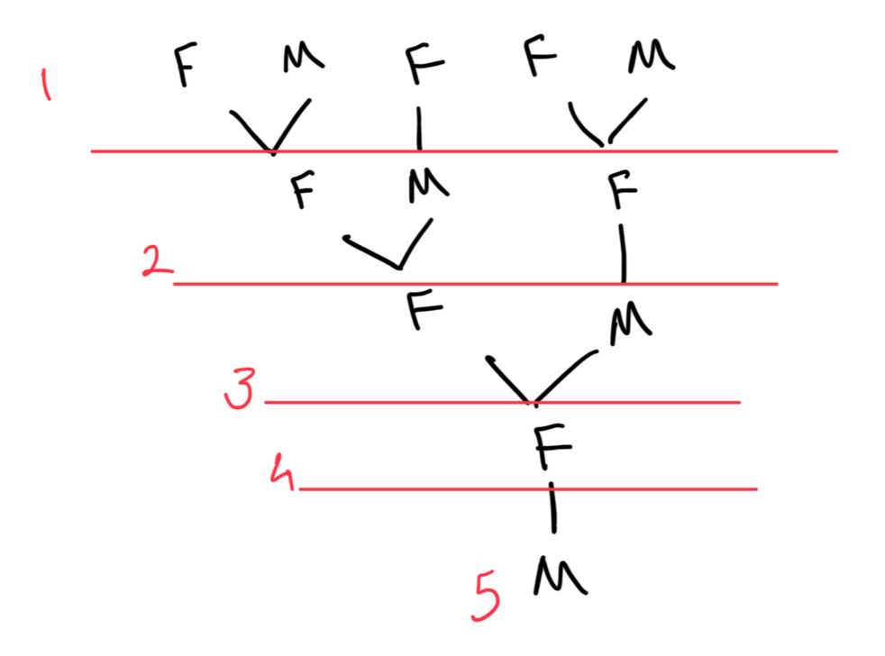

## Bee Genealogy

>[!info] Bee Genealogy
>Male bees hatch from unfertilized eggs and so have a mother but no father. Female bees hatch from fertilized eggs. How many ancestors does a male bee have in the twelfth generation back? How many of these are males?

### Entry

We'll specialise by drawing a sample diagram.
The red numbers indicate the ancestors.

### Attack

Looking at the diagram, a clear pattern emerges $1, 1, 2, , 3, 5, ...$  . This is the Fibonacci sequence.

**Conjecture**: The total number of ancestors in any generation `n` is the `nth` Fibonacci number.

We now try to understand how the number of ancestors in any generation `n` relates to previous generations.

1. The total ancestors in generation $n$ which we call $A_n$ are the parents of the ancestors in generation $n-1$.
2. The ancestors in generation $n-1$ are made up of $M_{n-1}$ males and $F_{n-1}$ females.
3. Each of those $F_{n-1}$ females has two parents in generation $n$.
4. Each of those $M_{n-1}$ males has one parent in generation $n$.

From this, we can build a structural argument:

1. The number of females in generation $n$, $F_n$, is the sum of the mothers of the previous generation's males and females. That's one mother for each, so $F_n = M_{n-1} + F_{n-1}$, which is simply the total number of ancestors in the previous generation $A_{n-1}$.
2. The number of males in generation $n$, $M_n$, comes only from the female ancestors in generation $n-1$. So, $M_n = F_{n-1}$.
3. The total number of ancestors in generation $n$ is $A_n = F_n + M_n$.
4. Substituting our findings, we get: $A_n = A_{n-1} + F{n-1}$.
5. And since $F_{n-1} = A_{n-2}$ (the number of females in one generation equals the total ancestors of the generation before it), we arrive at the final structural link: $A_n = A_{n-1} + A_{n-2}$.

This formula is the definition of the Fibonacci sequence.
### Review

The distinction between a proof and a mathematical structure feels blurry.
The AHA moment was seeing the Fibonacci pattern emerge in the total number of ancestors.

## Square Dissection

>[!info] Square Dissection
>A number N is called nice if a square can be dissected into N non-overlapping squares. What numbers are nice?

### Entry
The key is to use the process of **specializing** to get a feel for the problem.

- **What do I KNOW?** I'm cutting a large square into smaller, non-overlapping squares. An important clarification, as the book points out, is to check for
    
    **hidden assumptions**. The problem does _not_ say the smaller squares must be the same size. This is a crucial piece of freedom! * **What do I WANT?** I want to find the complete set of numbers, _N_, that are "nice". I want to characterize them.
    
- **What can I INTRODUCE?** Diagrams.

Specializing with small numbers:
- **N=1:** A square is already 1 square. So, **1 is nice**.
- **N=2, 3:** After a few sketches, it seems impossible to dissect a square into 2 or 3 smaller squares. Let's conjecture that **2 and 3 are not nice**.
- **N=4:** Easy! A simple 2x2 grid of identical squares works. So, **4 is nice**.
- **N=5:** This seems impossible, much like 2 and 3. Let's conjecture that **5 is not nice**.

So far, our set of nice numbers is {1, 4, ...} and our "not nice" set is {2, 3, 5, ...}.
### Attack

#### The Key Insight: The "+3 Operation"

Take any single square in the _K_-dissection and dissect it into a 2x2 grid of four smaller squares.

This action removes one square and adds four new ones, for a net gain of three squares. So, if a number _K_ is nice, then **K+3** must also be nice.

We know 1 is nice, so applying the +3 operation gives us $1+3=4, 4+3=7, 7+3=10, ...$ these are numbers in the form $3k + 1$.

Below we see how we can get 6 and 8. 

So, we can form a conjecture.
- From 6, we can generate $9, 12, 15, ...$ (all numbers in the form $3k$)
- From 7, we can generate $10, 13, 16, ...$ (all numbers in the form $3k+1$)
- From 8, we can generate $11, 14, 17, ...$ (all numbers in the from $3k+2$)

These three families, taken together, generate every single integer greater than or equal to 6! Why? Because any integer, when divided by 3, must have a remainder of 0, 1, or 2
### Review

**REFLECT:** The key moments were:

1. Realizing the squares could be different sizes (avoiding a hidden assumption).
2. Discovering the recursive _K_ -> _K_+3 construction. This turned the problem from a series of special cases into a structured system.
3. Realizing we needed more than one base case and searching for them.
4. Using a number theory argument (remainders mod 3) to justify that our constructions covered all possibilities.