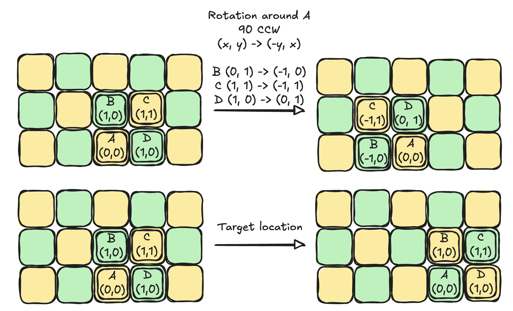

> [!info] Furniture
> A very heavy armchair needs to be moved, but the only possible movement is to rotate it through 90 degrees about any of its corners. Can it be moved so that it is exactly beside its starting position and facing the same way?

## Solution

1. Checkerboard your floor
	- Tile the floor with big squares of size = 0.5 x chair-width
	- Colour them using green and yellow
2. Initial and target colours
	- Start square: suppose the four legs of the chair sits on the four tiles creating a `2x2` block.
	- Target square: one chair width to the right.

> [!info] Conjecture: Rotation preserves square colour
> 
> A 90 degree rotation around any corner moves the chair from square (x, y) to one of
>
> `(x+1, y+1), (x+1, y-1), (x-1, y-1), (x-1, y+1)`
> 
> In every case `(x + y) mod 2 = 0` which means any sequence of rotations will place the corner on the same colour.

To reach the end goal we will need to shift by 1 in the `x` direction in which case `(x + y) mod 2 != 0` . This means no sequence of rotations is possible to reach the target location.

## Review
- I was confused for a while because I didn't really understand what it meant to place the chair exactly beside the starting location. I kept shifting each corner tile by exactly one location. This is wrong because placing exactly beside would mean the two right legs would occupy the same tile as the two left legs. That's where the requirement for tiles to change their colour comes from.

