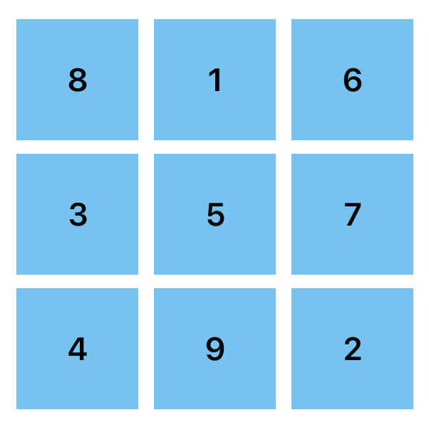
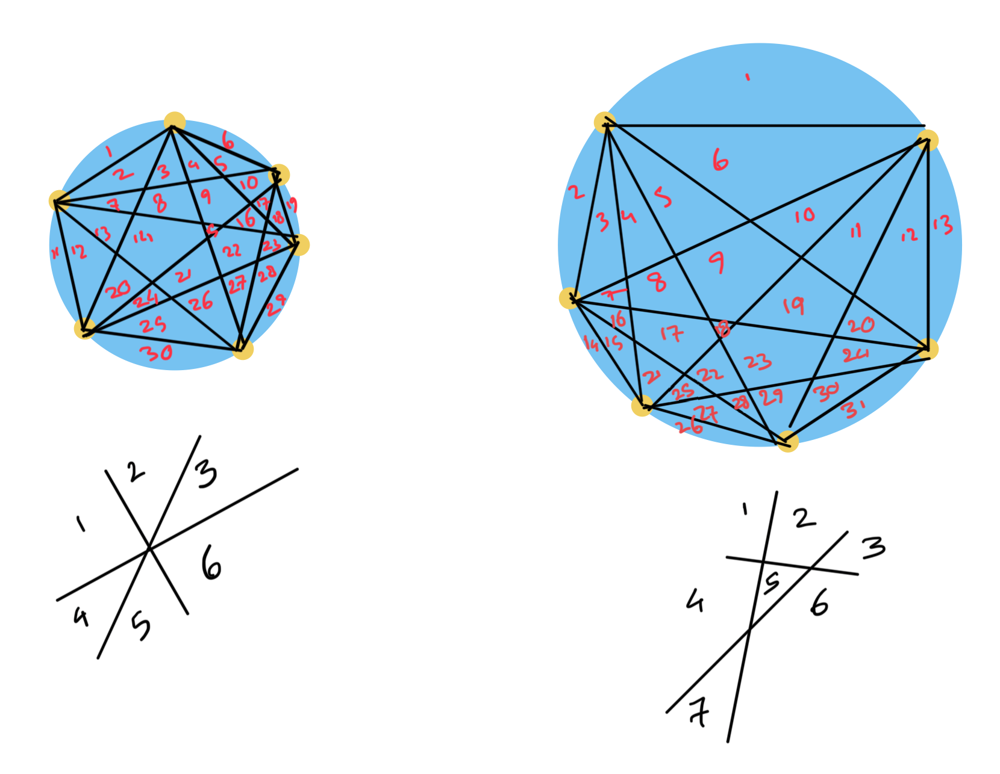

## Furniture

> [!info] Furniture
> A very heavy armchair needs to be moved, but the only possible movement is to rotate it through 90 degrees about any of its corners. Can it be moved so that it is exactly beside its starting position and facing the same way?

### Attack

1. Checkerboard your floor
	- Tile the floor with big squares of size = 0.5 x chair-width
	- Colour them using green and yellow
2. Initial and target colours
	- Start square: suppose the four legs of the chair sits on the four tiles creating a `2x2` block.
	- Target square: one chair width to the right.

> [!info] Conjecture: Rotation preserves square colour
> 
> A 90 degree rotation around any corner moves the chair from square (x, y) to one of
>
> `(x+1, y+1), (x+1, y-1), (x-1, y-1), (x-1, y+1)`
> 
> In every case `(x + y) mod 2 = 0` which means any sequence of rotations will place the corner on the same colour.

To reach the end goal we will need to shift by 1 in the `x` direction in which case `(x + y) mod 2 != 0` . This means no sequence of rotations is possible to reach the target location.


### Review
- I was confused for a while because I didn't really understand what it meant to place the chair exactly beside the starting location. I kept shifting each corner tile by exactly one location. This is wrong because placing exactly beside would mean the two right legs would occupy the same tile as the two left legs. That's where the requirement for tiles to change their colour comes from.

## Consecutive Sums

>[!info] Consecutive Sums
>
>Some numbers can be expressed as the sum of a string of consecutive positive numbers. Exactly which numbers have this property? For example, observe that
>
> ```
 >9 = 2 + 3 + 4
 >11 = 5 + 6
 >18 = 3 + 4 + 5 + 6
 >```

### Entry
### Attack

**Initial Observations:**
The numbers the cannot be expressed this way are 1, 2, 4, and 8. They are all powers of two.

**Conjecture:** A number can be expressed as a sum of consecutive positive numbers if and only if it is **not a power of two**.

How can we justify this? Why powers of two behave differently?
To answer the "why", we need to look at the structure of these terms.

Let's say a number `N` is the sum of `k` consecutive positive integers, starting with `a+1`.

```text
N = (a + 1) + (a + 2) + ... + (a + k)
```

Using the formula for arithmetic series, this sum is:

```text
N = k * (first term + last_term) / 2
N = k * ((a + 1) + (a + k)) / 2
2N = k * (2a + k + 1)
```

This tells us that `2N` can be factored into two numbers, `k` and `(2a + k + 1)`. Notice that one of these factors, `k`, represents the number of terms in our sum, and the other, `(2a + k + 1)`, is related to the starting point and length of the sum. Notice, `(2a + k + 1) = (a + 1) + (a + k)` which is the sum of the starting point and the last term.

Now, let's analyse the parity (evenness or oddness) of the factors:

- `k` and `k+1` are consecutive integers, so one must be even and one must be odd.
- Therefore, `(2a + k + 1)` has the opposite parity to `k`.
- **Conclusion:** One of our factors, `k` or `(2a + k + 1)` must be odd.

This means that `2N` must have an odd factor greater than 1. If the odd factor were 1, then either `k = 1`, meaning the sum has only one term, or `(2a + k + 1) = 1`, which is not possible for positive `a` and `k > 1`.

So, which numbers `N` have the property that `2N` has an odd factor?

>[!info] Case 1
> If N has an odd factor d > 1, then 2N also has that same odd factor d.

This sentence describes numbers like 6, 9, 10, 12, 14, 15, etc. - any number that isn't a power of two.

Let's break this down:

- `N` has an odd factor `d > 1` means we can write `N` as `d x (something)`.
- Then `2N` also has that same odd factor, if we multiply `N` by 2, the original odd factor is still there.

We conclude, any number `N` that has an odd factor satisfies our rule and therefor all these numbers can be expressed as a sum of consecutive numbers.

>[!info] Case 2
>If N has no odd factors greater than 1, it must be a power of 2 and 2N has no odd factors greater than 1.

Let's break this down:

- `N` has no odd factors greater than 1, then all of its prime factors must be the number 2.
- Then `2N = 2 x 2^m = 2^(m + 1)`, if we multiply a power of 2 by 2, we just get the next power of two.

Any number `N` that is a power of two fails our rule. The number `2N` does not have an odd factor. Therefore, powers of two cannot be expressed as a sum of consecutive numbers.


## Square Differences

>[!info] Square Differences
>Which numbers can be expressed as the difference of two perfect squares?

### Entry

**SPECIALISING:** let's try a few examples to see what kind of numbers we can get. 

```text
1 = 1² - 0²
2 = No
3 = 2² - 1²
4 = 2² - 0²
5 = 3² - 2²
6 = No
7 = 4² - 3²
8 = 3² - 1²
```

### Attack

We look for a pattern and try to understand why it holds. The expression $a^2 - b^2$ can be factored into $(a  - b)(a + b)$ .

Let's call our number `N`. So, $N = a^2 - b^2 = (a - b)(a + b)$ . For `a` and `b` to be whole numbers, $(a-b)$ and $(a+b)$ must both be whole numbers, and they must have the same parity. Let's see why:

- If both $(a - b)$ and $(a+b)$ are odd, their sum $(a-b) + (a+b) = 2a$ is even, and their difference $(a+b)-(a-b) = 2b$ is even. So, `a` and `b` are whole numbers.
- If both $(a-b)$ and $(a+b)$ are even, their sum and difference are also even, so `a` and `b` are whole numbers.
- If one is even and one is odd, their sum and difference would be odd, meaning `2a` and `2b` would be odd, which is impossible for whole numbers `a` and `b`.

So, any number that can be expressed as a difference of two squares must be the product of two numbers of the same parity.

Now let's consider the different types of numbers for `N`:

1. **Odd Numbers**

Any odd number `N` can be written as `1 x N`. Here, both factors (1 and N) are odd. So we can always find `a` and `b`:

- $a- b = 1$
- $a+b = N$ solving these gives us $a=(N+1)/2$ and $b=(N-1)/2$. Since `N` is odd, `N+1` and `N-1` are even, so `a` and `b` will be whole numbers.

**Conclusion:** All odd numbers can be expressed as the difference of two squares.

2. **Even Numbers**

For an even number `N`, it must be the product of two even numbers. The two factors $(a-b)$ and $(a+b)$ must always have the same parity. They are either both even or both odd.

Why? Let's look at their difference: $(a + b) - (a-b) = 2b$. Since $2b$ is an even number, the two factors $(a+b)$ and $(a-b)$ must either both be even or both be odd. It's impossible for an even number and an odd number to have a difference that is even.

It is impossible to have both factors odd, because $odd * odd$ will always be odd. So, the two factors must be even. So, $N = (2k)(2m) = 4km$. This means that `N` must be a multiple of 4.

We can write $N= 4k = 2(2k)$. Both factors are even:

- $(a - b) = 2$
- $(a + b) = 2k$ Solving this gives us $a = k + 1$ and $b = k - 1$. Both are whole numbers.

**Conclusion:** All multiples of 4 can be expressed as the difference of two squares.

What about even numbers that are not multiples of 4? These are numbers like 2, 6, 10, 14 and so on. They can be written in the form $4k + 2$. If we factor such a number, one factor must be 2, and the other must be an odd number $(2k + 1)$. This means the factors have different parity. Therefore, numbers of the form $4k + 2$ cannot be expressed as the difference of two squares.
### Review

A number can be expressed as the difference of two perfect squares if and only if it is an odd number or a multiple of 4.


## Fifteen

>[!info] Fifteen
>Nine counters marked with the digits 1 to 9 are placed on the table. Two players alternately take one counter from the table. The winner is the first player to obtain, amongst his or her counters, three with the sum of exactly 15.

### Entry

The first step is to figure out all the possible winning combinations. What sets of three different numbers from 1 to 9 sum to 15?

- Starting with 1: {1, 5, 9}, {1, 6, 8}
- Starting with 2: {2, 4, 9}, {2, 5, 8}, {2, 6, 7}
- Starting with 3: {3, 4, 8}, {3, 5, 7}
- Starting with 4: {4, 5, 6}

There are exactly 8 winning combinations.
### Attack

Now that we have the winning combinations, how does that help us play? Remembering every combination and tracking what you and your opponent have is difficult.

Let's try to find an analogy. A 3x3 magic square uses the numbers from 1 to 9, and every row, column, and main diagonal sums to 15.



There are 8 lines that sum to 15. These are the exact same 8 winning combinations we found earlier.

The game of Fifteen is mathematically identical to the game of **Tic-Tac-Toe**.

Choosing a counter is the same as placing a mark (X or O) in the corresponding square. Getting three counters that sum to 15 is the same as getting three marks in a row, column, or diagonal.

#### The Winning Strategy

1. **Best first move:** The strongest opening move in Tic-Tac-Toe is to take the centre square. In the game of Fifteen, this corresponds to taking the counter 5.
2. **Blocking and Winning:** Your subsequent moves should be guided by the magic square. If you opponent has two numbers that lie on a line in the square (e.g. they have taken 8 and 1), you must take the third number on that line (6) to block them. At the same time, you are trying to acquire three numbers that form a line for yourself.
3. **Optimal play:** Just like in Tic-Tac-Toe, if both players know the strategy, the game will end in a draw. You win by taking advantage of an opponent who doesn't see the underlying Tic-Tac-Toe structure.
### Review

The key to solving Fifteen was not arithmetic skill, but the ability to generalise and recognise an underlying structure. We moved from a numerical problem to a positional one.

## Circles and Spots

>[!info] Circles and Spots
> Place N spots around a circle and join each pair of spots by straight lines. What is the greatest number of regions into which the circle can be divided by this means?
> 
> For example, when there are 4 spots, 8 regions is the maximum possible number of regions (in this case 8 is also the minimum).

### Entry

We specialise to get a feel for what's happening.

Let N be the number of spots and R be the maximum number of regions.

| N (Spots) | R (Regions) |
| --------- | ----------- |
| 1         | 1           |
| 2         | 2           |
| 3         | 4           |
| 4         | 8           |
| 5         | 16          |

### Attack

Looking at this table, a very strong and simple pattern emerges. The number of regions seems to be doubling each time. This leads to a conjecture.

**Conjecture:** For N spots, the greatest number of regions is $2^{N-1}$ .

Let's test the case for $N=6$. We predict 32 regions but can only produce 31 regions.

Here I struggled for a while to figure out why I could only draw 30 regions. The key point is how regions are created when three lines intersect. Putting the spots in a symmetrical manner will result in some lines to cross at the same intersections which produces less regions. To create 31 regions, I needed to ensure spots are less symmetrical and no three lines will cross at the same intersection.



So why did the pattern break? The simple doubling pattern wasn't connected to how the regions are made. A better way to count the regions is to understand what creates them. The number of regions is determined by the number of parts the circle and the lines are divided into.

The number of regions is determined by the number of spots, lines, and interior intersection points.

- The number of lines (L) we draw is the number of ways to choose 2 spots from N, which is the binomial coefficient `C(N, 2)`.
- The number of interior intersection points (I) is created by the intersection of two lines. Each such point is uniquely defined by a set of 4 spots on the circle. So, the number of intersection points is the number of ways to choose 4 spots from N, which is `C(N, 4)`.

The maximum number of regions `R(N)`is:

```text
R(N) = 1 + L + I
R(N) = 1 + C(N, 2) + C(N, 4)
R(N) = 1 + (N(N-1)/2) + (N(N-1)(N-2)(N-3))/24
```

>[!info] Binomial Coefficient
>
>A binomial coefficient answers the question: "How many different ways can I choose k items from a larger set of n items?"
>
>The key here is that the order in which the items are chosen doesn't matter.

### Review

- It shows the power of specialising to generate data and suggest a pattern.
- It provides a warning about dangers of generalising too quickly. A conjecture requires a justification based on structure.